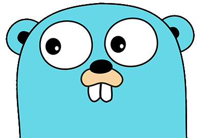

## [Welcome here!](https://vpenando.github.io) | [Articles](https://vpenando.github.io/articles.html) | [Main projects](https://vpenando.github.io/projects.html) | [About me](https://vpenando.github.io/about.html)

### (FR) EXPRESS #2 - Du bon usage de `godoc`

###### Note importante
> Cet article fait partie de la série "EXPRESS". Il s'agit d'une série d'articles relativement courts et moins formels, axés autour d'un point sur lequel je ne me voyais pas écrire un article complet. Le ton y est volontairement plus léger afin d'en faciliter la lecture (et l'écriture !).

---

Bonjour !

Si vous êtes ici, c'est que vous avez lu la note en début de page (a priori juste au-dessus), et que vous ne vous attendez par conséquent pas à un article très formel comme ce que j'ai l'habitude de publier sur ce blog.

Au court de ce bref article, je vais présenter l'outil de génération de doc inclus avec Go, et comment l'utiliser. Rien de bien sorcier, vous verrez !



---

### La documentation à l'ère du jurassique
Il y a fort longtemps, lorsque la terre n'abritait pas encore l'humanité, écrire une doc était très fastidieux. Déjà parce que les dinosaures ne savaient pas écrire, mais surtout parce que l'on n'avait pas d'outils vraiment taillés pour.
Puis virent le jour des outils tels que [Doxygen](http://www.doxygen.nl/), permettant de générer une documentation à partir des commentaires contenus dans vos fichiers source.

Doxygen est un très bon outil (que j'utilise pour le C++), mais dans le cas de Go, il convient d'utiliser un outil plus moderne. Et comme dirait un certain personnage de Kaamelott : à godoc.

---

### Et aujourd'hui ?
Certains langages de programmation (car c'est ce qui nous intéresse, dans le cas présent) embarquent des outils de génération de doc. C'est le cas de Go, dont nous allons parler ici.

Go, né il y a une petite dizaine d'années, est le langage de programmation créé par Google pour répondre aux problématiques inhérentes à Google. Il a ensuite été démocratisé au fil des années, jusqu'à se hisser parmi [les langages les plus populaires](https://hackr.io/blog/best-programming-languages-to-learn-2020-jobs-future).

Sa grande popularité s'explique par sa simplicité et son expressivité. Ces qualités font partie de l'ADN de Go, et son outil de génération de doc, godoc, suit la même philosophie. Sa [documentation en ligne](https://golang.org/pkg/) a été créée avec godoc.

---

### Mise en pratique
Avant tout, créons une fonction quelconque :
```go
func Quelconque() {
    // ...
}
```
Ajoutons-y quelques ingrédients, tels que des paramètres :
```go
func Quelconque(param1 int, param2 string) {
    // ...
}
```
Enfin, implémentons-la !
```go
func Quelconque(param1 int, param2 string) {
    for i := 0; i < param1; i++ {
        fmt.Println(param2)
    }
 }
 ```
À présent, nous allons nous atteler à documenter cette fonction "à la Go". Cet outil fonctionne un peu comme Doxygen, énoncé plus haut ; tout se base sur les commentaires. Néanmoins, le commentaire doit commencer par le nom de la fonction.
```go
// Quelconque affiche N fois une chaîne de caractères donnée.
func Quelconque(param1 int, param2 string) {
    for i := 0; i < param1; i++ {
        fmt.Println(param2)
    }
}
```
Pour insérer du code dans notre doc, il suffit simplement de le précéder d'un espace :
```
ceci n'est pas du code
 ceci est du code
```
À l'usage :
```go
// Quelconque affiche N fois une chaîne de caractères donnée.
// Exemple d'utilisation :
//  Quelconque(42, "Bonjour !")
func Quelconque(param1 int, param2 string) {
    for i := 0; i < param1; i++ {
        fmt.Println(param2)
    }
}
```
Pour documenter un type, rien de plus simple :
```go
// Foo est un type.
type Foo struct {
    Champ1 string // Documentation pour le champ 1
    Champ2 int    // Documentation pour le champ 2
}
```
Voilà, vous savez à présent écrire une documentation rudimentaire pour votre code Go !

---

### Mise en pratique (un tout petit peu) avancée
Si vous avez un peu fouillé dans la doc de Go, vous avez probablement remarqué qu'il y a parfois des exemples de code ! C'est cool ça ! 
Vous vous en doutez, il est bien entendu possible de le faire avec godoc !

Néanmoins, cela n'est pas aussi simple que ce que l'on a vu au-dessus. Il me faut d'abord faire un bref apparté sur comment fonctionnent les tests en Go.

Pour chaque fichier source, il est possible de créer des tests en créant un autre fichier, portant le même nom suivi du suffixe `_test`. Par exemple, si l'on crée `quelconque.go`, le fichier de tests associé sera nommé `quelconque_test.go`. Et c'est exactement ce que l'on va faire !

`quelconque.go` :
```go
package quelconque

import (
    "fmt"
)

// Quelconque affiche N fois une chaîne de caractères donnée.
// Exemple d'utilisation :
//  Quelconque(42, "Bonjour !")
func Quelconque(param1 int, param2 string) {
    for i := 0; i < param1; i++ {
        fmt.Println(param2)
    }
}
```
Pour créer un exemple de `Quelconque` qui sera affiché dans la doc, il faut créer une fonction d'exemple dans `quelconque_test.go`. Cette fonction doit s'appeler `ExampleQuelconque`, et son contenu sera affiché dans la doc. Pour afficher son output, il suffit d'y inclure un commentaire commençant par `Output:`.

`quelconque_test.go` :
```go
package quelconque

func ExampleQuelconque() {
   Quelconque(1, "Ceci est une documentation très utile")
   // Output: Ceci est une documentation très utile
}
```
Pour consulter godoc, il suffit de lancer dans un terminal :
```shell
$ godoc
```
Nous pouvons alors consulter la documentation en nous rendant sur `localhost:6060`.

---

Et voici ce à quoi ressemble la documentation de notre nouvelle fonction :


