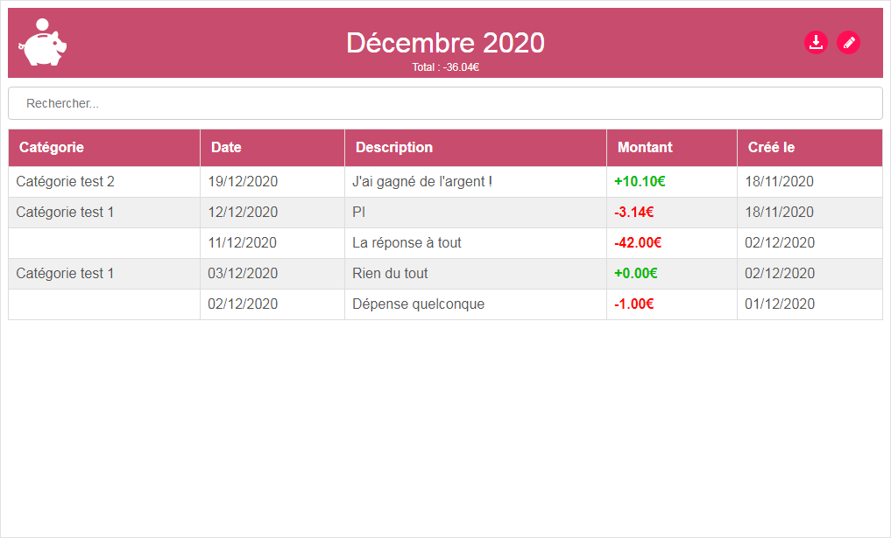

## [Welcome here!](https://vpenando.github.io) | [Articles](https://vpenando.github.io/articles.html) | [Main projects](https://vpenando.github.io/projects.html) | [About me](https://vpenando.github.io/about.html)

## (FR) HS #1 - Création d'un outil de suivi de dépenses

---

### Introduction

D'ordinaire, je ne présente pas de projet perso ici. Néanmoins, je fais aujourd'hui une petite exception et en profite pour inaugurer la série "HS".
Il ne s'agit donc pas d'un article classique où je présente une techno ou autre, mais plutôt d'un bilan, d'un ressenti général sur un petit projet que je mène sur mon temps libre. Par ailleurs, j'emploierai un ton un peu plus léger que d'habitude.

---

### Contexte

Prenons notre DeLorean et envolons-nous en l'an de grâce 2017.

En 2017 (plus exactement en février, d'après les archives que j'ai retrouvées sur Discord), alors que je suis encore étudiant, je commence le développement d'un outil permettant de suivre et catégoriser ses dépenses.
Il s'agit alors d'une petite application sans prétention, faite en C#. Côté charte graphique, il a été décidé de partir sur un visuel rappelant les vieilles tirelires en forme de cochon. Je ne sais plus pourquoi, mais ça rendait bien. La direction artistique était alors toute trouvée : l'icône, les couleurs, tout était évident à partir du moment où l'idée de la tirelire a émergé. Même le nom du projet, Piggy, vient de l'anglais "piggy bank".

 Screen de l'application datant de 2017. C'est flashy, mais ça marche, c'est déjà ça !

Cette petite application était essentiellement utilisée par mes proches, pour leurs besoins personnels. C'est encore le cas aujourd'hui, et de nouveaux besoins émergent :
* *Je veux pouvoir créer de nouvelles catégories ! Sinon, dans quoi je range les dépenses pour le chat ?*
* *Je veux pouvoir exporter mon bilan du mois vers Excel !*
* *Je veux des graphiques par mois/année/catégories !*
* *Je veux rechercher une dépense !*
* *Je veux [insérez ce que vous voulez ici] !*

Sauf que... mon PC d'étudiant a rendu l'âme, emportant avec lui les sources du projet, que je n'avais bien évidemment pas hébergées sur un repo distant. Quel génie.
Honnêtement, je dois reconnaître que ça m'a pas mal découragé. J'ai clairement laissé tombé le projet pendant plusieurs années, malgré plusieurs tentatives de le reprendre from scratch.

---

### 2020 : la résurrection du cochon

Retour en 2020, le présent à l'heure où je rédige ces lignes, probablement le passé pour vous. Nous sommes alors en décembre, et tout le monde attend la venue du Père Noël.

Face à de nouvelles demandes et profitant de mon temps libre, je décide de travailler "vite fait" sur un prototype d'une espèce de Piggy nouvelle génération. Rien de bien fou, à ce moment-là c'est juste pour me faire la main sur Go. L'idée est alors de me "challenger" un peu sur mes compétences en Go et voir jusqu'où je peux les pousser. Très rapidement, je m'oriente vers du web afin de pouvoir pleinement exploiter la puissance de Go (et pas du tout parce que le langage n'est pas taillé pour des applis de bureau ^^"). J'arrive donc à la conclusion suivante :
* Le back sera fait en Go ;
* Le front sera fait en HTML/CSS/JS (je reviendrai sur ce choix plus bas dans l'article).

 Gopher, la mascotte du langage.

Cela revêt plusieurs avantages, notamment de pouvoir héberger le serveur sur mon poste perso ou sur la Rapberry Pi de la maison ; ainsi, je peux mettre à jour l'application sans déranger les utilisateurs/trices, tout se fait de manière transparente.

Alors, en avant ! Je commence à écrire sur papier les différentes fonctionnalités à implémenter, réfléchir à leur implémentation, et développer un petit prototype. Heureux, j'arrive très rapidement (entre une demi journée et une journée) à un résultat !

 Screen de l'application, décembre 2020 (WIP).

La plupart des fonctionnalités sont opérationnelles : on peut créer/modifier/supprimer des opérations, filtrer par catégorie/description, télécharger un rapport Excel, et le visuel est plus propre qu'avant. Le reste à faire est encore conséquent, mais ça avance !

Cerise sur le gâteau, le projet est hébergé sur GitHub, et bientôt open source ! Il sera donc disponible pour tout le monde !

---

### Côté technique

Comme brièvement évoqué plus haut, l'un des objectifs premiers de ce projet était de m'améliorer en Go. En effet, il s'agit d'un langage que j'affectionne énormément, et sur lequel je cherche à me perfectionner. Ainsi, ce petit projet, aussi mince soit-il, a été l'occasion d'utiliser pour la première fois `gorilla/mux` et `gorm`, par exemple.

Côté front, c'était en revanche un poil plus compliqué. J'ai notamment pour contrainte de n'avoir aucune dépendance tierce à faire installer aux utilisateurs, problème qui ne se pose pas en Go, où l'exécutable compilé n'a *aucune* dépendance. En effet, je veux que le projet soit utilisable tel quel lorsqu'un utilisateur *-notamment un utilisateur sans aucune connaissance technique-* le télécharge. C'est actuellement le cas avec l'ancienne version : on télécharge l'application, on la lance et ça marche.
Là où une application réellement orientée SaaS ne s'impose, par essence, pas de telles contrainte, je me dois de maintenir une certaine accessibilité auprès de chacun.
