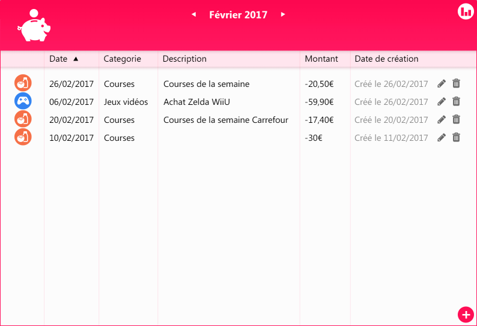

## [Welcome here!](https://vpenando.github.io) | [Articles](https://vpenando.github.io/articles.html) | [Main projects](https://vpenando.github.io/projects.html) | [About me](https://vpenando.github.io/about.html)

## (FR) HS #1 - Création d'un outil de suivi de dépenses

---

### Introduction

D'ordinaire, je ne présente pas de projet perso ici. Néanmoins, je fais aujourd'hui une petite exception et en profite pour inaugurer la série "HS".
Il ne s'agit donc pas d'un article classique où je présente une techno ou fais part d'avis/conseils, mais plutôt un bilan, un ressenti général sur un petit projet que je mène sur mon temps libre. Par ailleurs, j'emploierai un ton un peu plus léger que d'habitude, à la manière d'un article "EXPRESS".

---

### Contexte.

Prenons notre DeLorean et envolons-nous en l'an de grâce 2017.

En 2017 (plus exactement en février, d'après les archives que j'ai retrouvées sur Discord), alors que je suis encore étudiant, je commence le développement d'un outil permettant de suivre et catégoriser ses dépenses.
Il s'agit alors d'une petite application sans prétention, faite en C#. Côté charte graphique, il a été décidé de partir sur un visuel rappelant les vieilles tirelires en forme de cochon. Je ne sais plus pourquoi, mais ça rendait bien. La direction artistique était alors toute trouvée : l'icône, les couleurs, tout était évident à partir du moment où l'idée de la tirelire a émergé. Même le nom du projet, Piggy, vient de l'anglais "piggy bank".

 Screen de l'application datant de 2017.

Cette petite application était essentiellement utilisée par mes proches, pour leurs besoins personnels. C'est encore le cas aujourd'hui, et de nouveaux besoins émergent :
* *Je veux pouvoir créer de nouvelles catégories ! Sinon, dans quoi je range les dépenses pour le chat ?*
* *Je veux pouvoir exporter mon bilan du mois vers Excel !*
* *Je veux des graphiques par mois/année/catégories !*
* *Je veux [insérez ce que vous voulez ici]* !

Sauf que... mon PC d'étudiant a rendu l'âme, emportant avec lui les sources du projet, que je n'avais bien évidemment pas hébergées sur un repo distant. Quel génie.
Honnêtement, je dois reconnaître que ça m'a pas mal découragé.

---

### 2020 : la résurrection du cochon

Retour en 2020, le présent à l'heure où je rédige ces lignes.

Face à de nouvelles demandes et profitant de mon temps libre, je décide de travailler "vite fait" sur un prototype d'une espèce de Piggy nouvelle génération. Rien de bien fou, c'est juste pour me faire la main sur Go à ce moment-là.
