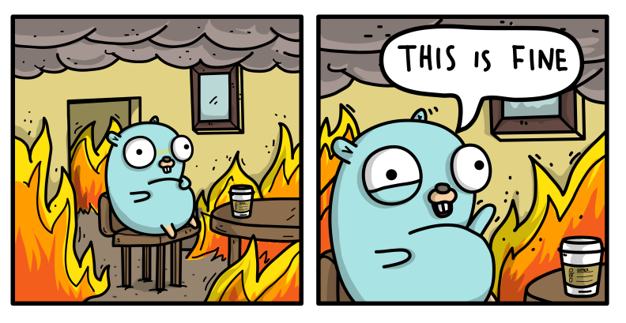

## [Welcome here!](https://vpenando.github.io) | [Articles](https://vpenando.github.io/articles.html) | [Main projects](https://vpenando.github.io/projects.html) | [About me](https://vpenando.github.io/about.html)

### (FR) Introduction à `go test`

---

### Sommaire
* Introduction
* Le package `testing`
* Présentation du package `assert`
* Conclusion

---

### Introduction

Coder, c'est bien. Toutefois, produire quelque chose qui fonctionne comme attendu, c'est encore mieux. Ainsi, il est de bon goût de tester notre code afin de s'assurer que
notre output fait bien ce que l'on attend de lui et que tous les cas tordus ont bien été prévus. À cet effet, plusieurs catégories de tests existent : tests unitaires, tests manuels, tests de non régression... Chacune a ses intérêts, qui sont tous complémentaires.

Je ne connais aucun programmeur qui *aime* tester, mais tous s'accordent à dire qu'il n'y a pas de meilleure manière pour assurer la stabilité d'un programme. Cela nous rajoute du travail à court terme, mais nous permet d'éviter l'incendie au lieu de devoir l'éteindre.

Affirmer qu'un code marche correctement sans l'avoir testé, c'est comme ne tester personne lors d'une épidémie et dire que personne n'est malade. Invraisemblable, non ?



*([Source](https://github.com/ashleymcnamara/gophers))*

Go embarque dans sa bibliothèque standard un package qui fournit un environnement de test clés en main et très simple d'utilisation. Au cours de cet article, nous verrons comment l'utiliser, et comment enrichir nos tests grâce à un package tiers, `assert`.

---

### Le package `testing`

Avant de tester notre code à proprement parler, une petite précision doit être apportée. Chacun de nos tests doit être créé dans un fichier dont le nom doit suivre la forme `*_test`. Ainsi, pour tester le contenu du fichier `foo.go`, il convient de créer un fichier `foo_test.go`. De plus, chaque fonction de test doit avoir un nom commençant par `Test` suivi d'une majuscule. Enfin, chaque fonction de test doit attendre un argument de type `*testing.T`. Le type `*testing.T` expose diverses méthodes permettant de tester à proprement parler notre code. Rendez-vous sur la [doc officielle](https://golang.org/pkg/testing/#T) pour tous les détails.

Exemple :
```go
// foo.go
package foo

func Foo() error {
    // ...
}
```
Le fichier de test associé devrait être proche de :
```go
// foo_test.go
package foo

import (
    "testing"
)

func TestFoo(t *testing.T) {
    if err := Foo(); err != nil {
        t.Fatalf("Something bad happened: %s", err)
    }
    // ...
}
```
Concernant le test en lui-même, nous utiliserons différentes méthodes fournies par le type `*testing.T` afin de vérifier nos différents cas. Rien de bien sorcier !

---

### Présentation du package `assert`

Le package `assert` ([source](https://godoc.org/github.com/stretchr/testify/assert)) permet d'enrichir nos tests en apportant de nouvelles fonctions, telles que `Equal`, `True`, `False`, `Nil`, et, bien entendu, leurs versions suffixées de `f` !

Exemple :
```go
// foo_test.go
package foo

import (
    "testing"

    "github.com/stretchr/testify/assert"
)

func TestFoo(t *testing.T) {
    err := Foo()
    assert.Nilf(t, err, "Something bad happened: %s", err)
    assert.True(t, /* une expression booléenne */)
    assert.False(t, /* une autre expression booléenne */)
    assert.Equal(t, /* une valeur */, /* une autre valeur */)
}
```
Ce package apporte également d'autres fonctions plus spécifiques, telles que `Panics`, `FileExists`, `HTTPStatusCode`... Ainsi, cela permet à la fois de réduire la quantité de code dans nos tests, mais également de gagner en expressivité lors de leur relecture !

---

### Conclusion

Go est un langage extrêmement bien outillé. En tant que tel, il met à disposition un moteur de test très puissant, et surtout très complet. Au-delà des tests classiques, il permet aisément de mesurer les performances d'un code via le type [`*testing.B`](https://golang.org/pkg/testing/#B), que nous aborderons dans un prochain article.
