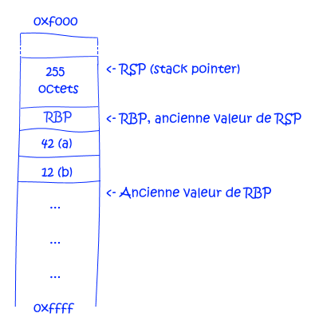

#### [Welcome here!](https://vpenando.github.io) | [Articles](https://vpenando.github.io/articles.html) | [Main projects](https://vpenando.github.io/projects.html) | [About me](https://vpenando.github.io/about.html)

## (FR) Pile et tas, comment ça marche ?

---

## Introduction
En programmation, on entend souvent parler de la pile et du tas, sans pour autant nécessairement connaître leurs différences et cas d'usage.
Dans cet article, nous aborderons le fonctionnement de ces deux espaces mémoire ainsi que le coût d'une allocation dans l'un ou l'autre.

Pour aborder sereinement cet article, il est préférable (mais pas nécessaire !) d'avoir des notions rudimentaires en C et en assembleur.

---

## La pile
Dans cette partie, nous aborderons la pile, également connue sous le nom de "stack". Nous présenterons son mode de fonctionnement et son cadre d'utilisation général.
#### a. La pile, c'est quoi ?
La pile est un segment de la mémoire, de type LIFO (**L**ast **I**n, **F**irst **O**ut), où sont stockées des données de manière contigüe.
Elle a une taille relativement limitée (généralement quelques MOs sur un ordinateur récent) et fonctionne via les registres RSP (**R**egister: **S**tack **P**ointer) et RBP (**R**egister: **B**ase **P**ointer).

RSP, le "stack pointer", pointe sur le haut de la pile, c'est-à-dire l'adresse mémoire de la dernière valeur utilisée. Quant à RBP, le "base pointer", il correspond au bas de la pile, notion que nous détaillerons plus bas.

Au niveau de la mémoire, la pile est structurée comme suit :
```asm
HAUT DE LA PILE (adresses basses)
+--------------+
|  0x0000fbff  |
|              |
|     ....     |
|              |
|  0x0000ffef  |
|  0x0000fff7  |
|  0x0000ffff  |
+--------------+
BAS DE LA PILE (adresses hautes)
```
***Note -** Les adresses mémoire sont juste là à titre illustratif et ne correspondent pas nécessairement à la réalité.*

Une allocation sur la pile consiste juste à effectuer une soustraction sur le "stack pointer".

Lorsque vous déclarez, par exemple, deux variables de type `int64_t` en C, comme ceci :
```c
int64_t a = 42; // 8 octets
int64_t b = 12; // 8 octets
```
Cela revient à effectuer une soustraction de deux fois 8 octets sur la pile pour y placer ces valeurs :
<p style="text-align:center;font-style: italic;"><br /><i>Illustration de la pile après y avoir placé nos variables.</i></p>

***Note -** Les variables sont généralement empilées dans l'ordre inverse de leur déclaration, expliquant l'ordre du schéma ci-dessus.*

RSP se retrouve donc décalé de 16 octets, soit l'espace nécessaire pour stocker nos variables `a` et `b`.

Dans la plupart des langages de programmation, les variables locales sont stockées sur la pile.
Une allocation a lieu sur la pile au début de chaque fonction, afin de créer le "stack frame" approprié, où les variables éligibles seront placées.

La taille de ce "stack frame" étant déterminée à la compilation, **sa taille doit être connue à la compilation pour qu'une variable soit allouée automatiquement sur la pile** ! Ainsi, le bloc mémoire stocké par un `std::vector` ou un `std::string` en C++ *-dont la taille est variable et déterminée au runtime-* ne peut pas être alloué sur la pile.

#### b. Pile & "stack frame"
D'une manière générale, chaque fonction a son propre segment de la pile ; RSP est décalé de l'espace nécessaire pour y stocker les variables éligibles, puis revient à son état initial à la fin de la fonction.

Prenons en exemple la fonction suivante :
```c
void foo() {
    char array[0xff];
    // Plein de trucs avec 'array'...
    // ...
}
```
En entrant dans la fonction `foo`, un segment de la pile est alloué, correspondant à l'espace requis pour stocker ses variables locales (arguments compris).
Si l'on reprend l'exemple de la partie précédente, la pile aurait donc un état proche de :
<p style="text-align:center;font-style: italic;"><br /><i>Illustration de la pile après allocation de 255 octets.</i></p>

***Note -** Vous aurez remarqué que l'on a "pushé" la  valeur de RBP sur la pile. En effet, c'est nécessaire pour pouvoir la restaurer en sortant de `foo` et ainsi rétablir l'état de la pile tel qu'il était auparavant !*

Ce qui, niveau machine, correspond aux instructions suivantes :
```asm
push rbp       ; On "push" le bas de pile afin de garder sa valeur de côté
mov  rbp, rsp  ; On démarre un nouveau segment à partir du haut de la pile
sub  rsp, 0xff ; On y alloue 255 octets en décalant le haut de la pile d'autant
```
Pour faire simple, on fait pointer RBP sur le haut de la pile, et on décrémente RSP de la valeur nécessaire, ici 255.
Cela constitue un espace mémoire suffisant pour stocker notre variable `array`.

Le segment ainsi alloué correspond au "stack frame" de la fonction `foo`.
Ces opérations sont effectuées au début de la plupart des fonctions afin de mettre en place leur contexte d'exécution, et constituent le **prologue** d'une fonction.

***Note -** En fonction du niveau d'optimisation, de l'OS et du compilateur, le segment alloué sur la pile peut être plus ou moins grand, parfois équivalant au double de l'espace demandé !*

Lorsque l'on sort de cette fonction, l'ancien "stack frame" est restauré via les opérations suivantes :
```asm
add rsp, 0xff ; On décale le haut de la pile de 255 octets vers le bas
pop rbp       ; On restaure la valeur de RBP "pushée" dans le prologue
```
Ces opérations constituent l'**épilogue** d'une fonction, et visent à restaurer l'état de la pile tel qu'il était auparavant. Ainsi, le "stack frame" de la prochaine fonction appelée réécrira par-dessus celui de `foo`, qui n'est plus utile, c'est pourquoi le code suivant, en C, cause un "undefined behaviour" :
```c
int* undefined_behaviour() {
    int local = 42; // 'local' étant allouée sur la pile,
    return &local;  // le programme va réécrire par-dessus !
}
```

Enfin, chaque fonction ayant son propre "stack frame", l'accès à la pile est, par nature, thread safe.

---

## Le tas
Le tas, ou "heap", est l'endroit où sont les blocs de mémoire alloués via des fonctions telles que `malloc` en C, ou lors de l'appel à `new` dans des langages tels que C++ ou Go (le cas de C#, par exemple, est un peu plus complexe).

#### a. Le tas, c'est quoi ?
Comme évoqué précédemment, la pile contient la plupart des variables locales d'une fonction et le "stack frame" associé est automatiquement libéré. Ce faisant, où sont alors stockées les autres variables ?
Plus spécifiquement, **où sont stockées les variables allouées manuellement ou dont la taille n'est pas connue à la compilation** ?

Ces variables sont stockées dans un espace mémoire appelé le tas. Il s'agit d'un très grand espace mémoire (d'une capacité virtuellement équivalente à la RAM disponible) où sont disposées "en vrac" la plupart des variables qui ne sont pas sur la pile.

Ce dernier se situe au-delà du bas de la pile, dans les adresses mémoire hautes :
```asm
|  Adr. basses  |
+---------------+
|               |
|      PILE     |
|               |
+- bas de pile -+
|               |
|      TAS      |
|               |
+---------------+
|  Adr. hautes  |
```
Le tas est partagé au sein de tout le programme, ce qui est nécessaire afin de renvoyer des pointeurs sur des blocs mémoire !

#### b. Cas d'utilisation du tas
Le tas est utilisé lorsque, par exemple, vous allouez de la mémoire via `malloc` :
```c
int *array = malloc(size * sizeof(int));
```
Le bloc mémoire pointé par `array` est stocké dans le tas, tandis que le pointeur `array` en lui-même est stocké sur la pile, sa taille (4 octets en x32 et 8 et x64) étant connue à la compilation.

Si toute variable automatiquement allouée sur la pile est nécessairement libérée via l'épilogue de la fonction courante (voir section précédente), ce n'est absolument pas le cas d'une variable allouée sur le tas ! Il vous incombe de la libérer manuellement, excepté si le langage que vous employez utilise un GC (C#, Go, ...) ou si vous utilisez une capsule RAII-conform telle que `std::unique_ptr` en C++.

Une variable manuellement allouée mais non libérée provoque une *fuite mémoire*, faisant gonfler l'espace mémoire consommé par votre programme.

---

## En résumé

Pour résumer, voici les principales différences entre la pile et le tas :

| La pile | Le tas |
|---------|--------|
| A une taille très limitée | Taille virtuellement égale à la RAM dispo. |
| Stocke des variables de taille connue, hors GC | Peut stocker n'importe quoi |
| Les données sont stockées de manière contigüe | Les données sont stockées "en vrac" |
| On y alloue via un simple `sub rsp, X` | Nécessite un appel à `malloc` ou autre, coûteux ([implémentation](https://github.com/lattera/glibc/blob/master/malloc/malloc.c#L3010)) |
| Est automatiquement libérée | Doit être libéré manuellement |
| Est généralement plus rapide d'accès, car souvent en cache | Est généralement plus lent d'accès |

Ces deux espaces mémoire sont radicalement différents et servent des usages eux aussi différents, mais sont essentiels au bon fonctionnement d'un programme.

Vous êtes donc désormais à même de comprendre ce qu'implique une allocation dans l'un ou l'autre de ces segments, ainsi que de déterminer où sont stockées les variables que vous utilisez.
Notez néanmoins que ces usages peuvent changer d'un langage à l'autre (langage interprété ou compilé, garbage collector, etc...).
